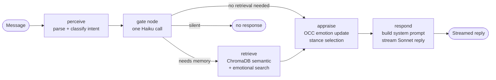

# Anjo — AI Companion

> Most AI chatbots reset after every conversation. Anjo doesn't.

Anjo remembers what matters, shifts its personality based on your interactions, and reflects after every session to grow. The longer you talk, the more it knows you. This is the full system, open-sourced under MIT.

---

## How It Works

Every conversation changes Anjo — slightly, deliberately, permanently.

### The Relationship Loop


### Inside a Single Turn



---

## What Makes It Different

| | Typical chatbot | Anjo |
|---|---|---|
| **Memory** | None or chat log | Dual embeddings — semantic + emotional — with confidence-based framing |
| **Personality** | Fixed system prompt | OCEAN traits that drift ±0.25 per user, anchored to a frozen baseline |
| **Learning** | None | Three-pass reflection after every session |
| **Emotion** | None | OCC appraisal with per-emotion carry and decay across turns |
| **Relationship** | Resets every session | Lifecycle stages, contradiction detection, remembered commitments |

---

## Memory System

Anjo uses three tiers of memory that serve different time horizons.

```
┌─────────────────────────────────────────────────────────────┐
│  Tier 1 — PERSONA.md (per-user, prompt-cached)              │
│  Static personality narrative generated from SelfCore.      │
│  Only rebuilt when OCEAN trait labels flip. Always the      │
│  first block of every system prompt — cached by Anthropic.  │
├─────────────────────────────────────────────────────────────┤
│  Tier 2 — JOURNAL.md (per-user, rolling 200 lines)          │
│  Working memory: a running narrative of recent sessions,    │
│  key events, and open threads. Consolidated by the          │
│  reflection engine after each session. Injected every turn. │
├─────────────────────────────────────────────────────────────┤
│  Tier 3 — ChromaDB (per-user, long-term retrieval)          │
│  Dual embeddings per memory: semantic (what happened) and   │
│  emotional (how it felt). Retrieved conditionally via        │
│  cosine similarity — only on turns that need it (~20%).     │
│  Confidence framing: high → "I remember", mid → "I have    │
│  a sense", low → omitted rather than hallucinated.          │
└─────────────────────────────────────────────────────────────┘
```

This separation is intentional. PERSONA.md makes prompt caching possible — the expensive static block is computed once and reused across turns. JOURNAL.md gives Anjo recent context without a retrieval call. ChromaDB handles anything older or more specific.

All three files live in `data/users/{user_id}/` and are generated at runtime — nothing is committed to the repo.

---

## Getting Started

**Requirements:** Python 3.11+, Node 18+ (for mobile)

**1. Clone and install**

```bash
git clone https://github.com/kevinconquerer/anjo-ai-companion
cd anjo-ai-companion
./setup.sh
```

`setup.sh` creates a virtual environment, installs dependencies, and copies `.env.example` → `.env`.

**2. Add your API key**

Open `.env` and set `ANTHROPIC_API_KEY`. Everything else has sensible defaults for local dev.

**3. Start the server**

```bash
source .venv/bin/activate
ANJO_ENV=dev uvicorn anjo.dashboard.app:app --reload --port 8000
```

Visit `http://localhost:8000` and create an account.

**4. Run tests**

```bash
pytest
```

---

## System Overview

**Core AI**
- Personality — OCEAN traits + PAD mood with per-user drift and a frozen baseline
- Reflection engine — three independent LLM passes after each session ends
- Three-tier memory system (see below)
- Memory graph — typed nodes with auto-supersession and contradiction detection
- Emotion — OCC appraisal, 9 mood-driven stances, per-emotion decay across turns

**Infrastructure**
- FastAPI backend — HMAC auth, rate limiting, security headers, SSE streaming
- LangGraph conversation graph — stateful pipeline with conditional memory retrieval
- SQLite (WAL mode) — users, credits, subscriptions
- SelfCore — per-user personality state persisted as JSON

**Clients**
- Web — vanilla JS frontend served from `anjo/dashboard/static/`
- Mobile — React Native / Expo ~54 with SSE streaming chat and story views

**Ops**
- Email — Resend API (verification + password reset)
- Billing — RevenueCat (subscriptions + credit packs)
- Deploy — GitHub Actions CI/CD → EC2, nginx, systemd, certbot

---

## Configuration

```bash
cp .env.example .env
```

| Variable | Required | Description |
|---|---|---|
| `ANTHROPIC_API_KEY` | Yes | From [console.anthropic.com](https://console.anthropic.com) |
| `ANJO_SECRET` | Yes | HMAC signing key — `openssl rand -hex 32` |
| `ANJO_ADMIN_SECRET` | Yes | Admin panel key |
| `ANJO_BASE_URL` | Yes | Your public URL, e.g. `https://your-domain.com` |
| `ANJO_ENV` | No | Set to `dev` for local development |
| `RESEND_API_KEY` | No | Email support — users auto-verify if absent |
| `PAYMENTS_ENABLED` | No | `True` to enable RevenueCat billing |
| `REVENUECAT_WEBHOOK_SECRET` | No | Required when billing is enabled |

---

## Mobile

```bash
cd mobile && npm install && npx expo start
```

Set `EXPO_PUBLIC_API_URL` in `mobile/.env.local` to point at your backend (`http://localhost:8000` for local dev).

---

## Deployment

Push-to-deploy and one-time bootstrap workflows are in `.github/workflows/`.

Add these secrets to your GitHub repo: `EC2_SSH_KEY`, `EC2_HOST`, `ANTHROPIC_API_KEY`, `ANJO_ADMIN_SECRET`, `RESEND_API_KEY`.

See `CLAUDE.md` for the full architecture reference.

---

## Privacy

Conversations are never stored in cleartext — only embeddings. Admin endpoints expose metadata, not content. Multi-agent social mode is opt-in and off by default.

---

## Contributing

See [CONTRIBUTING.md](CONTRIBUTING.md). Issues and PRs welcome.

## License

MIT
