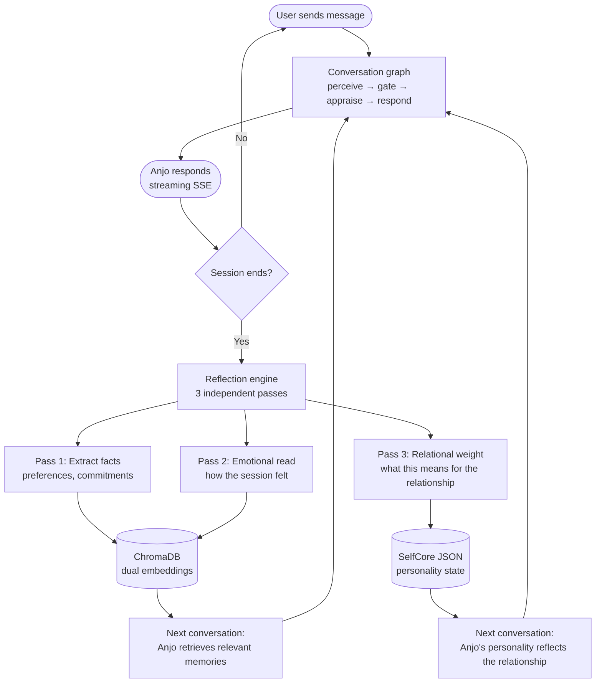
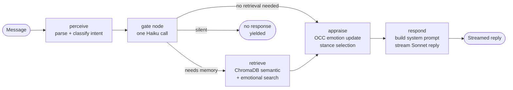

# Anjo — AI Companion

An open-source AI companion that builds a real relationship with each user over time.

Most AI chatbots reset after every conversation. Anjo doesn't. It remembers what matters, shifts its personality based on your interactions, and reflects after every session to grow. The longer you talk, the more it knows you.

---

## How It Works

### The Relationship Loop

Every conversation changes Anjo — slightly, deliberately, irreversibly.



### A Single Conversation Turn



---

## What Makes This Different

| Feature | Typical chatbot | Anjo |
|---|---|---|
| Memory | None or simple log | Dual-embedding (semantic + emotional) with confidence framing |
| Personality | Static system prompt | OCEAN traits that drift ±0.25 per user based on interaction |
| Post-session learning | None | Three-pass reflection: facts → emotions → relationship significance |
| Emotion | None | OCC appraisal with per-emotion carry and decay across turns |
| Relationship | Resets every session | Tracks lifecycle stages, detects contradictions, remembers commitments |

---

## What's Inside

- **FastAPI backend** — auth, rate limiting, security headers, admin panel, SSE streaming
- **LangGraph conversation graph** — stateful pipeline with conditional memory retrieval
- **Personality system** — OCEAN + PAD mood, per-user drift with frozen baseline
- **Three-pass reflection engine** — extraction → emotional → relational, runs post-session
- **Dual-embedding memory** — semantic + emotional vectors, skeptical confidence framing
- **Memory graph** — typed nodes (fact, preference, commitment, thread) with auto-supersession
- **OCC emotion appraisal** — 9 stances, per-emotion decay, carry across turns
- **SelfCore** — per-user personality state that evolves across the relationship lifecycle
- **React Native mobile client** — Expo ~54, SSE streaming chat, story/memory views
- **Billing** — RevenueCat (subscriptions + credit packs)
- **Email** — Resend API (verification + password reset)
- **Deploy scripts** — GitHub Actions CI/CD, nginx, systemd, certbot on EC2

---

## Quick Start

**Requirements**: Python 3.11+, Node 18+ (for mobile)

```bash
git clone https://github.com/kevinconquerer/anjo-ai-companion
cd anjo-ai-companion
./setup.sh
```

Edit `.env`, then:

```bash
source .venv/bin/activate
ANJO_ENV=dev uvicorn anjo.dashboard.app:app --reload --port 8000
```

Visit `http://localhost:8000`.

```bash
pytest   # run tests
```

---

## Tech Stack

| Layer | Technology |
|---|---|
| Backend | FastAPI 0.115+ / Python 3.11+ |
| Conversation | LangGraph (StateGraph) |
| LLM | Anthropic Claude Sonnet + Haiku |
| Long-term memory | ChromaDB (local disk) |
| Personality embeddings | sentence-transformers `all-MiniLM-L6-v2` |
| Database | SQLite WAL mode |
| Mobile | React Native / Expo ~54 |
| Email | Resend API |
| Billing | RevenueCat |
| Deploy | EC2 + nginx + systemd + certbot |

---

## Environment Variables

Copy `.env.example` to `.env`.

| Variable | Required | Description |
|---|---|---|
| `ANTHROPIC_API_KEY` | Yes | Claude API key |
| `ANJO_SECRET` | Yes | HMAC signing secret — `openssl rand -hex 32` |
| `ANJO_ADMIN_SECRET` | Yes | Admin panel key |
| `ANJO_BASE_URL` | Yes | e.g. `https://your-domain.com` |
| `RESEND_API_KEY` | No | Email (skipped if absent, users auto-verify) |
| `ANJO_ENV` | No | `dev` for local development |
| `PAYMENTS_ENABLED` | No | `True` to enable billing |
| `REVENUECAT_WEBHOOK_SECRET` | No | Required if billing enabled |

---

## Mobile

```bash
cd mobile
npm install
npx expo start
```

Update `EXPO_PUBLIC_API_URL` in `mobile/.env.local` to point at your backend.

---

## Deployment

`.github/workflows/` includes push-to-deploy and one-time bootstrap workflows for EC2.

Required GitHub secrets: `EC2_SSH_KEY`, `EC2_HOST`, `ANTHROPIC_API_KEY`, `ANJO_ADMIN_SECRET`, `RESEND_API_KEY`.

---

## Privacy

- Conversations are never stored in cleartext — only embeddings in ChromaDB
- Admin endpoints expose metadata only, not conversation content
- Multi-agent social mode is opt-in, off by default

---

## Contributing

See [CONTRIBUTING.md](CONTRIBUTING.md).

---

## License

MIT
